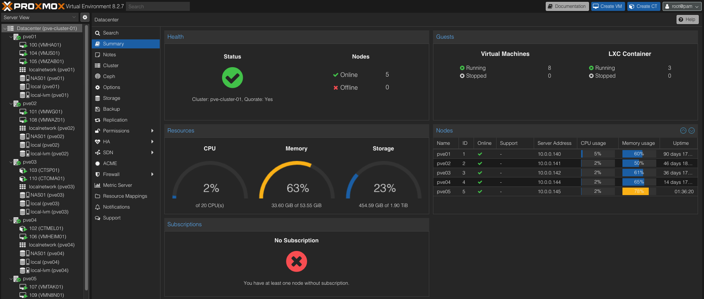

<!--
This template is GitHub-friendly Markdown (works in a repo README or MkDocs page).
Fill the placeholders in <angle brackets>. Remove sections you don’t need.
-->

# Proxmox Cluster — pve-cluster-01

**TL;DR:** 6-node Proxmox VE 8.x on repurposed laptops/desktops. Local **LVM-thin** on single SSD per node, flat network on `vmbr0` (`10.0.0.0/24`). Weekly **vzdump** to `NAS01` (Sun 03:00), retention **keep monthly: 2**, compression **ZSTD**. **Live migration:** QEMU VMs can migrate online without shared storage (disk is mirrored over the tunnel); expect longer migrations on 1G links. LXC typically needs downtime without shared storage.

<!-- expected hero image: cluster-hero.jpg -->


!!! note
    Network is **flat (no VLANs)**. VLAN sections are omitted on purpose.

---

## At a Glance

| Nodes | CPU/RAM (total)                                               | Storage (raw)                                        | Networks                     | Backups                                                    | HA                     |
|-----:|-----------------------------------------------------------------|------------------------------------------------------|------------------------------|------------------------------------------------------------|------------------------|
| 6    | i5-6300U ×2, i5-3337U ×2, i7-7500U ×1, FX-8350 ×1 / **88 GB** RAM | 256+256+128+128+512+500 GB ≈ **1.78 TB**             | `vmbr0` flat (`10.0.0.0/24`) | vzdump → **NAS01**, Sun 03:00, keep monthly: 2, ZSTD       | No (manual migrations) |

**Use cases:** Mealie, Home Assistant, ATAK server, Ubuntu Jump Station, SmokePing, Zabbix, WireGuard, Wazuh, Omada SDN Controller, OctoPrint, MQTT sensor node, n8n, Vaultwarden, Graylog, Cribl, Vulnerability Scanning.

---

## Cluster Health (quick checks)

- [ ] Quorum OK: `pvecm status` shows votes from all nodes
- [ ] Thin pool headroom on each node (`local-lvm`): >20% free
- [ ] Backups succeeded in last 7 days (vzdump log / NAS)
- [ ] CPU type consistent (e.g., `x86-64-v2-AES`) for portability
- [ ] Start/Shutdown order set on critical VMs; “On boot” = ✓

---

## Bridge (Flat) Overview

| Bridge | Uplink NIC (example) | Host IP (per-node)      | VLANs | VLAN-aware        | MTU  | Purpose                 | Notes                                  |
|------:|------------------------|--------------------------|-------|-------------------|------|-------------------------|----------------------------------------|
| vmbr0 | `<eth0 / enpXsY>`     | see **Inventory** below  | none  | **No (by design)**| 1500 | Management + VM network | VLAN-aware not required at present     |

---

## Inventory

### Nodes

| Node  | IP         | Cores | CPU Model | RAM (GB) | SSD (GB) | NICs              | Role        | Notes                                  | On AC (Y/N) |
|:-----:|------------|------:|-----------|---------:|---------:|-------------------|------------|----------------------------------------|:-----------:|
| PVE01 | 10.0.0.140 | 4     | i5-6300U  | 16       | 256      | `<1G / USB 2.5G>` | Hypervisor | Local **LVM** on single SSD            | Y           |
| PVE02 | 10.0.0.141 | 4     | i5-6300U  | 16       | 256      | `<1G / USB 2.5G>` | Hypervisor | Local **LVM** on single SSD            | Y           |
| PVE03 | 10.0.0.142 | 4     | i5-3337U  | 4        | 128      | `<1G / USB 2.5G>` | Hypervisor | Local **LVM** on single SSD            | Y           |
| PVE04 | 10.0.0.144 | 4     | i5-3337U  | 4        | 128      | `<1G / USB 2.5G>` | Hypervisor | Local **LVM** on single SSD            | Y           |
| PVE05 | 10.0.0.145 | 4     | i7-7500U  | 16       | 512      | `<1G / USB 2.5G>` | Hypervisor | Local **LVM** on single SSD            | Y           |
| PVE06 | 10.0.0.146 | 8     | FX-8350   | 32       | 500      | `<1G / USB 2.5G>` | Hypervisor | Local **LVM** on single SSD            | Y           |

### VMs / Services (Summary)

| Node | IP         | Name      | Service / Purpose                          |
|:----:|------------|-----------|--------------------------------------------|
| TBD  | 10.0.0.124 | VMVLT01   | Vaultwarden                                |
| TBD  | 10.0.0.125 | VMHAP01   | HAProxy                                    |
| TBD  | 10.0.0.126 | VMMON01   | Net Mon                                    |
| TBD  | 10.0.0.127 | VMINV01   | Asset Inventory Discovery                   |
| TBD  | 10.0.0.128 | VMHA01    | HomeAssistant VM                            |
| TBD  | 10.0.0.129 | VMTAK01   | ATAK Server                                 |
| TBD  | 10.0.0.130 | VMJS01    | Ubuntu Jump Station                         |
| TBD  | 10.0.0.132 | CTSP01    | Smoke Ping Server                           |
| TBD  | 10.0.0.133 | VMGRAY01  | Graylog                                     |
| TBD  | 10.0.0.134 | VMWG01    | WireGuard                                   |
| TBD  | 10.0.0.135 | VMCRIB01  | Cribl                                       |
| TBD  | 10.0.0.136 | CTOMD01   | Omada SDN Controller                         |
| TBD  | 10.0.0.138 | VMN8N     | n8n Server                                  |
| TBD  | 10.0.0.139 | VMVULN01  | Vulnerability Scanning                       |

---

## Storage & Backups

### Local Storage Layout (per node)

> Example from **PVE01** (others similar; sizes vary).

| Node  | Disk Model                 | Size   | Partitioning               | Volume Group | Datastore          |
|-------|----------------------------|--------|----------------------------|--------------|--------------------|
| PVE01 | Micron_1100_SATA_256GB     | 256 GB | BIOS boot, EFI, **LVM PV** | `pve`        | `local-lvm` (thin) |
| PVE02 | Micron_1100_SATA_256GB     | 256 GB | BIOS boot, EFI, **LVM PV** | `pve`        | `local-lvm` (thin) |
| PVE03 | SanDisk_SDSG2128G1052E     | 128 GB | BIOS boot, EFI, **LVM PV** | `pve`        | `local-lvm` (thin) |
| PVE04 | TOSHIBA_THNSNJ128GDNJ      | 128 GB | BIOS boot, EFI, **LVM PV** | `pve`        | `local-lvm` (thin) |
| PVE05 | SanDisk_SD8SN8U-512G       | 512 GB | BIOS boot, EFI, **LVM PV** | `pve`        | `local-lvm` (thin) |
| PVE06 | Samsung_SSD_850_EVO_500GB  | 500 GB | BIOS boot, EFI, **LVM PV** | `pve`        | `local-lvm` (thin) |

**Guardrail:** Alert if `local-lvm` (thin pool) free **<20%** to avoid “out of space” VM pauses.

### Backup Jobs (vzdump)

> Current Proxmox **Backup Job** (GUI):  
> Storage: **NAS01** · Schedule: **Sun 03:00** · Selection: **Include selected VMs** · Compression: **ZSTD (fast and good)** · Mode: **Stop** · Enabled: **Yes**  
> Retention: **Keep Monthly = 2** (others blank)

| Job Name      | Type   | Storage | Schedule   | Selection             | Compression | Mode | Enabled | Retention                 |
|---------------|--------|---------|------------|-----------------------|-------------|------|---------|---------------------------|
| `weekly-main` | vzdump | NAS01   | Sun 03:00  | Include selected VMs  | ZSTD        | Stop | ✓       | Monthly: 2 (others unset) |

**Restore tests (quarterly):** Restore one representative VM to an isolated network (or with NIC disconnected), validate service, record time-to-recover; update “Backups” table’s “Last Verify”.

**CLI equivalent (example)**
```bash
# Create/replace a weekly vzdump job (adjust VMIDs)
echo '0 3 * * 0 root vzdump 100 101 102 --storage NAS01 --compress zstd --mode stop' > /etc/pve/vzdump.cron
# Retention for NAS01 can also be set on the storage target or managed manually.
